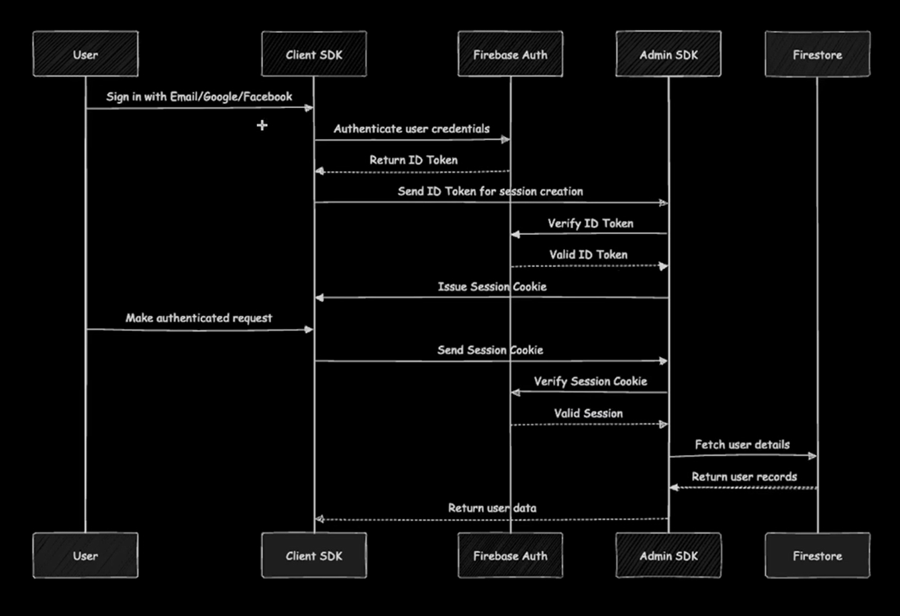

# IntelliPrep — AI-Powered Interview Practice Platform

IntelliPrep is a modern web application designed to help job seekers practice and prepare for interviews using AI-generated questions and real-time feedback. The platform offers a personalized, stress-free experience to boost users' confidence before stepping into the real interview room.

---

## Tech Stack

- **Frontend:** Next.js 14, TypeScript, TailwindCSS, ShadCN UI
- **Authentication:** Firebase Auth + Session Cookies
- **Backend:** Firebase Admin SDK (Auth + Firestore)
- **Database:** Firestore (NoSQL)
- **Validation:** Zod + React Hook Form
- **Voice Agent:** VAPI (Planned in upcoming phases)

---

## Completed So Far

### Phase 1: Authentication UI & Form Validation
- Clean and responsive **Sign-Up / Sign-In forms**
- Form-level validation using **Zod + React Hook Form**
- Conditional rendering of fields based on auth type

### Phase 2: Firebase Integration + Secure Session Auth
- Firebase Admin SDK setup for server-side auth
- Secure **session cookie generation & validation**
- Firestore integration to store and fetch user data
- Auth helper functions: `signUp`, `signIn`, `getCurrentUser`, `isAuthenticated`

> 💡 Implemented a cookie-based session model instead of token-only auth for better security and session persistence.

---

## Project Structure

```plaintext
ai_interview_prep/
├── app/                  → App routes (Next.js routing)
├── components/           → Reusable UI components
├── constants/            → Constants and shared values
├── firebase/
│   ├── admin.ts          → Firebase Admin SDK setup
│   └── client.ts         → Firebase Client SDK setup
├── lib/                  → Core logic (auth actions, utils)
├── public/               → Static files
├── types/                → Type definitions (e.g., User)
├── .env.local            → Environment variables
├── next.config.ts        → Next.js configuration
└── README.md             → You’re reading it :)
```

## Auth Flow Diagram

Here’s how session-based authentication works:



> The user logs in via Firebase Client SDK. The server verifies the ID token, creates a session cookie, and uses it to validate future requests securely.

---

## Environment Setup

Create a `.env.local` file and add your Firebase credentials:

```env
FIREBASE_PROJECT_ID=your_project_id
FIREBASE_CLIENT_EMAIL=your_client_email
FIREBASE_PRIVATE_KEY="your_private_key"
```
Also add public-side keys in Firebase config (client.ts):
```angular2html
const firebaseConfig = {
  apiKey: "",
  authDomain: "",
  projectId: "",
  storageBucket: "",
  messagingSenderId: "",
  appId: "",
}
```

## Upcoming Phases

- **Home Page Dashboard** for AI Interview Practice  
  Users will be greeted with a clean, personalized dashboard to initiate mock interviews, view progress, and access interview tips.

- 🎙️ **Voice Interview Agent (VAPI Integration)**  
  Integration of VAPI to simulate real interview environments using voice-based Q&A, making practice more interactive and realistic.

- 📊 **AI-powered Interview Feedback System**  
  After each mock session, users will receive instant AI-generated feedback to improve their communication, confidence, and content.

- **Role & Domain-based Question Generation**  
  Personalized interview questions tailored to user-selected roles and domains (e.g., Frontend Developer, Product Manager, etc.).

---
🎯 Building this project as a journey of growth — learning, creating, and innovating with AI.